# Projeto: Provisionamento Local de Kubernetes com Docker e Rancher

**Aluno**: Anderson Luiz Pancheniak ([anderson.pancheniak@outlook.com](mailto:anderson.pancheniak@outlook.com))  
**Matrícula**: 358342  
**Curso**: MBA Cloud Engineering & Architecture  
**Disciplina**: Gerenciamento de APIs  
**Professor**: Claudio Eduardo de Oliveira  

Este projeto visa o provisionamento de um cluster Kubernetes local utilizando Docker e Rancher, com a implantação automatizada via GitOps utilizando ArgoCD. O projeto também incorpora o Kong API Gateway para gerenciamento de APIs e um serviço de exemplo para validação da configuração.

Repositório GitHub: [andersonluizp/fiap](https://github.com/andersonluizp/fiap.git)  
> No repositório, encontra-se um vídeo explicativo detalhando todo o processo descrito abaixo.

## Ferramentas Utilizadas

- **Docker**: v25.0.3
- **Rancher**: v2.9.3
- **WSL2**: Subsistema Windows para Linux
- **Postman**: v11.18.0
- **Kubectl CLI**: v1.29.1
- **ArgoCD**: v2.12.6+4dab5bd

## Passo a Passo da Configuração

### 1. Inicializar Rancher em Contêiner Docker

Execute o Rancher como contêiner para gerenciar o Kubernetes:

```bash
docker run -d --restart=unless-stopped \
  -p 8080:80 -p 8443:443 \
  --privileged \
  rancher/rancher:latest
```
  
Recupere a senha de bootstrap:

```bash
docker logs container-id 2>&1 | grep "Bootstrap Password:"
```
Dica: Substitua container-id pelo ID do contêiner Rancher.

### 2. Configurar o Kubeconfig para Uso do Kubectl
Copie o arquivo kubeconfig para acessar o cluster Kubernetes através dos comandos kubectl.

### 3. Instalar ArgoCD no Cluster
Crie o namespace do ArgoCD:

```bash
kubectl create namespace argocd
```

Aplique o manifesto para instalar o ArgoCD:

```bash
kubectl apply -f https://raw.githubusercontent.com/andersonluizp/fiap/refs/heads/main/MBA%20Cloud%20Engineering%20%26%20Architecture/Gerenciamento%20de%20APIs/Atividade%201/k8s/manifests/argocd.yaml -n argocd
```

Recupere a senha de acesso inicial do ArgoCD:

```bash
kubectl get secret -n argocd argocd-initial-admin-secret -o jsonpath="{.data.password}" | base64 -d
```

Redirecione a porta para acessar o ArgoCD no navegador:

```bash
kubectl port-forward svc/argocd-server -n argocd 8888:80
```

Acesse o ArgoCD no navegador em https://localhost:8888/.

### 4. Configuração do Repositório para GitOps
Configure o repositório em Settings > Repositories dentro do ArgoCD para obter os manifestos de implantação:
https://github.com/andersonluizp/fiap.git

### 5. Estrutura dos Manifestos Helm

Os manifestos estão organizados no formato de templates Helm nas seguintes pastas:

- **k8s/manifests**: Contém todos os manifestos para os recursos do cluster.

- **kong**: API Gateway Kong (v2.7).

- **hello-world**: Serviço de teste de comunicação com o Kong API Gateway.


### 6. Validação do Kong API Gateway
Redirecione o tráfego para acessar o serviço através do Kong API Gateway. Após a configuração bem-sucedida, uma resposta com statusCode 200 será retornada, e ao inspecionar os cabeçalhos, você verá as seguintes entradas:

**Via**: kong/2.7.2

**X-Kong-Upstream-Latency**: 2

**X-Proxy-Latency**: 2020


### 7. Apêndice

#### Imagens

***1. Rancher tela inicial.***

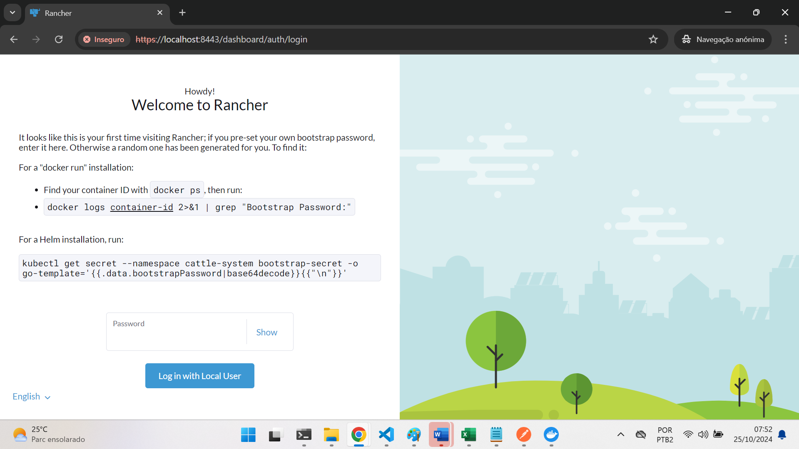

  
***2. Rancher obtendo a senha de acesso.*** 

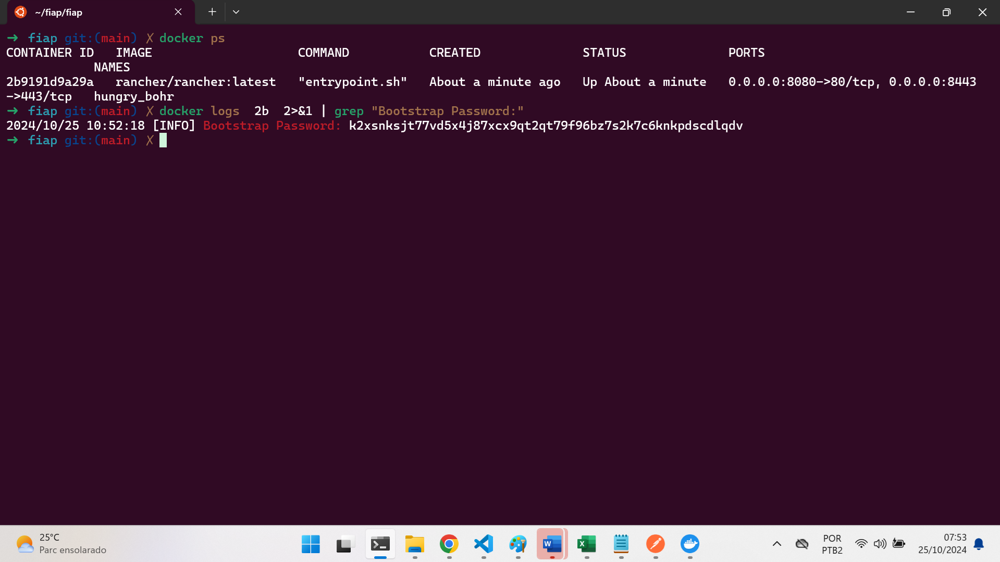


***3. Rancher ambiente Kubernetes***

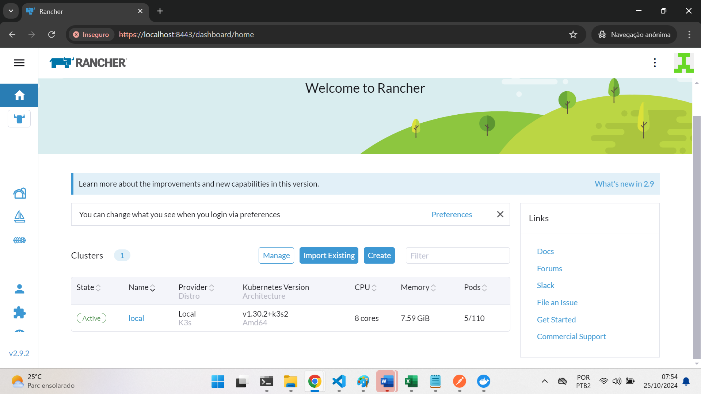


***4. Repositório que contém os arquivos de manifestos Helm a serem utilizados***

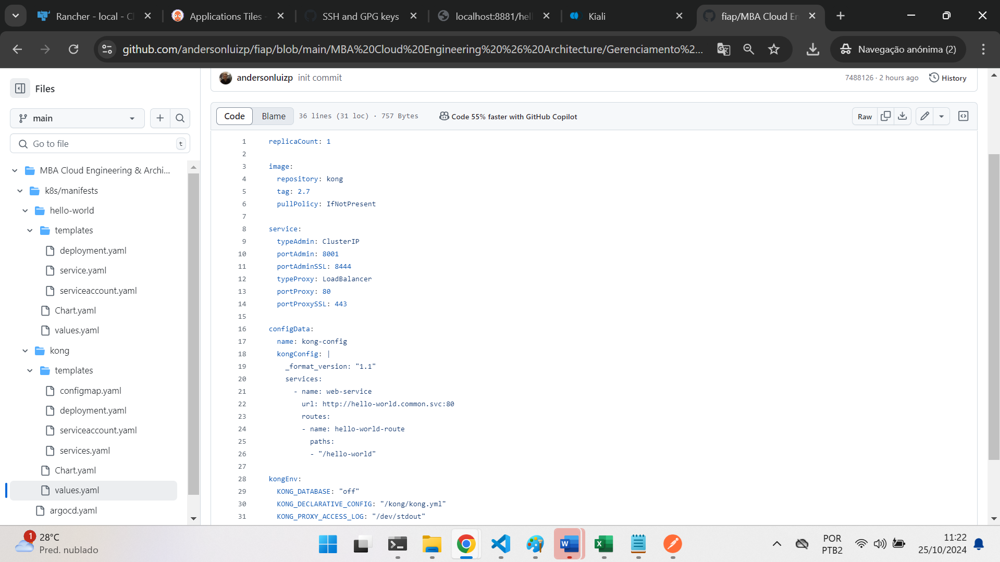


***5. Argo implantação Kong Api Gateway***

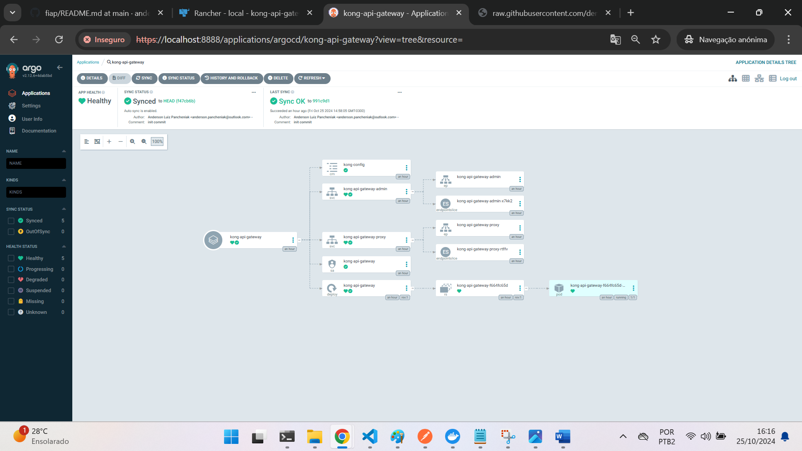

  
***6. Argo implantação Hello World***

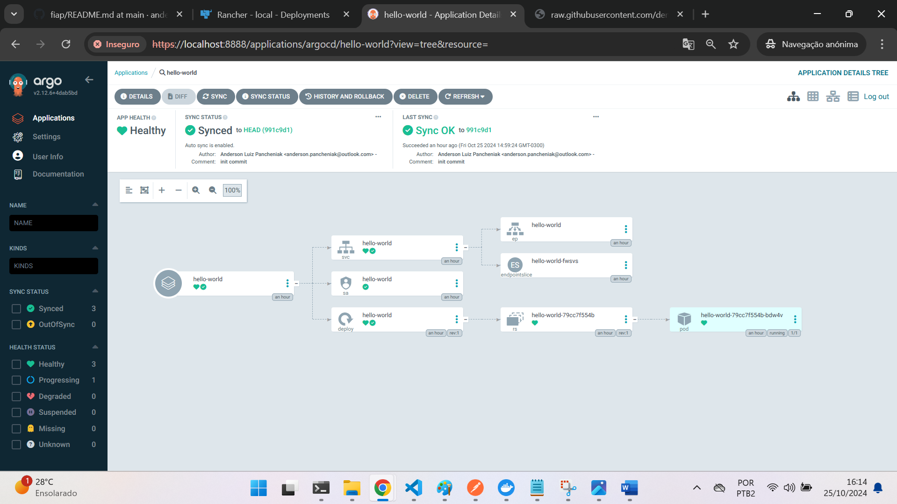


***7. Rancher visualização dos pods***

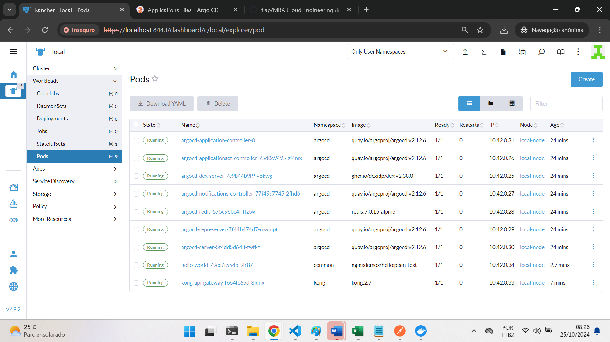


***8. Kong Api Gateway variável de ambiente KONG_DATABASE=off***

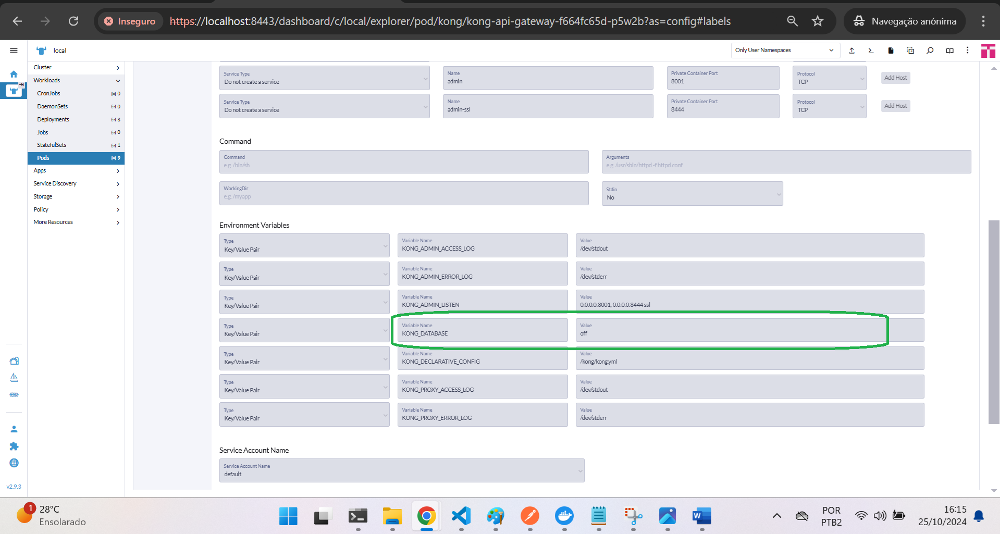


***9. Kong Api Gateway rotas cadastradas***

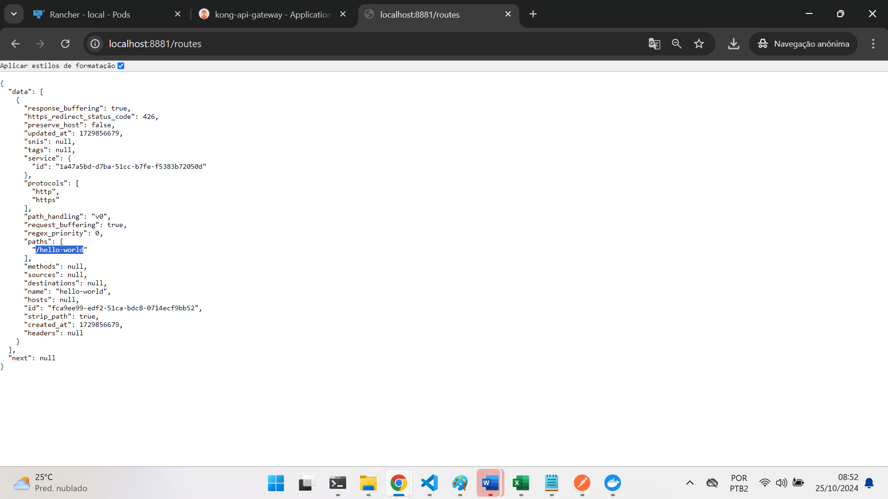


***10. Kong Api Gateway redirecionando porta para acesso***

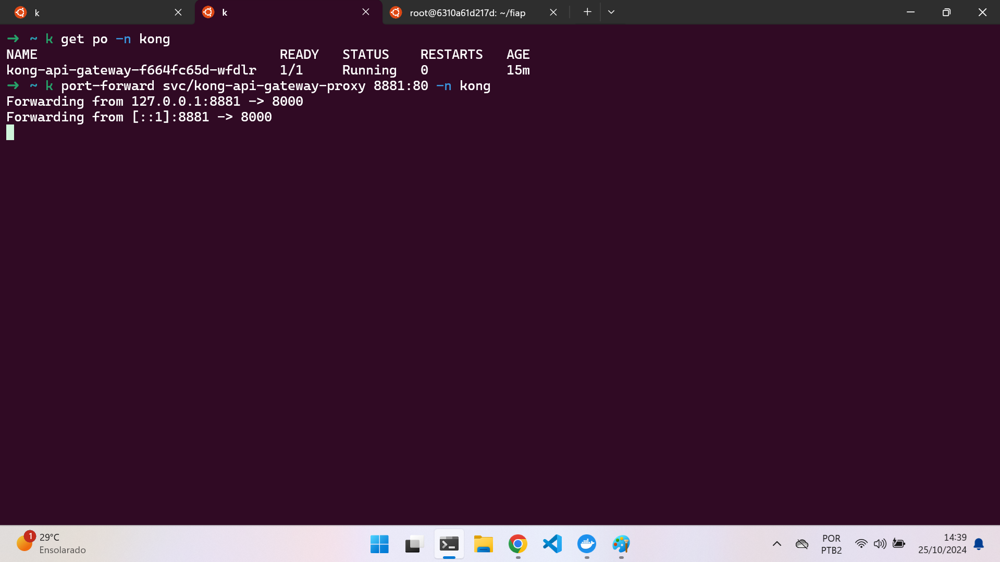


***11. Postman requisição para rota cadastrada serviço Kong Api Gateway***

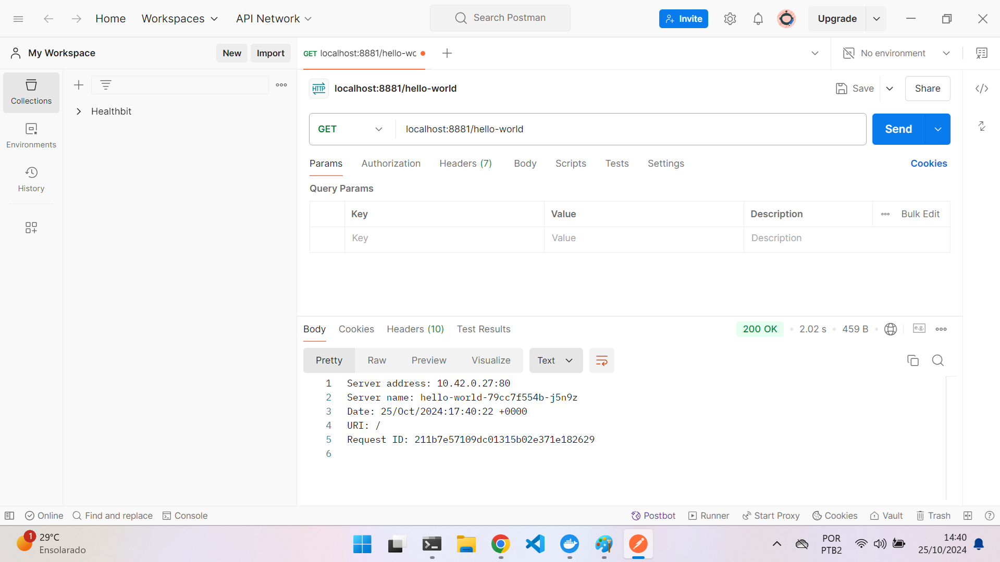


***12. Postman resultado da requisição para rota cadastrada serviço Kong Api Gateway***

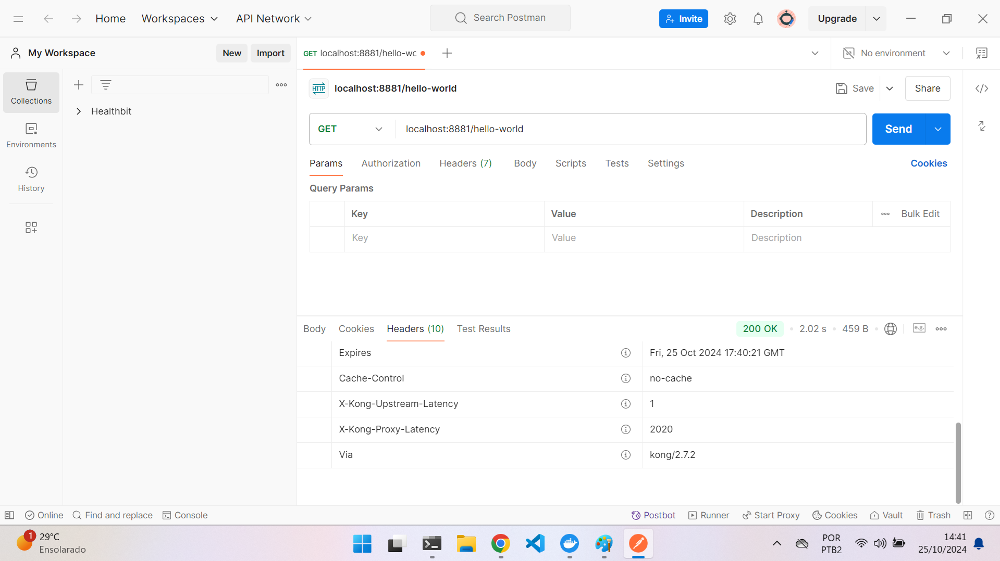
